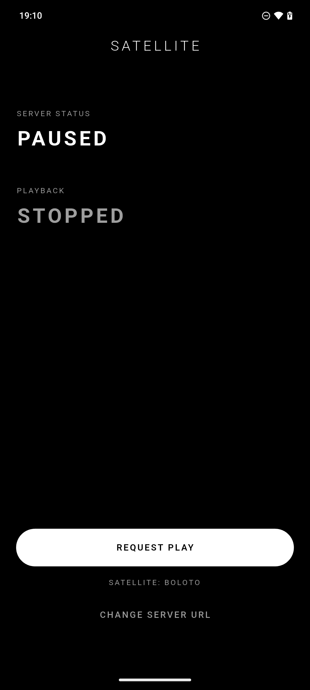
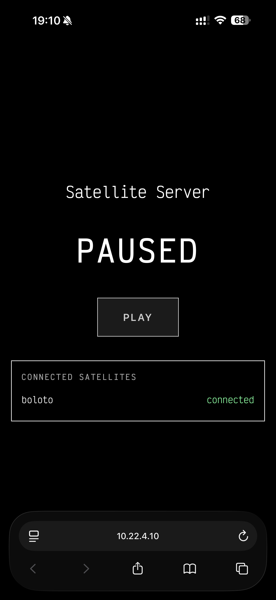

# Satellite

White-noise playback app made with Flutter and controlled by a Flask server.

## Setup

1. Create your root env file: `cp .env.example .env`
2. Enter the dev shell: `nix develop`

## How To Run

1. Start the server in the background with `process-compose up` or `process-compose up -D`
2. Start the Flutter app
    2.1. `cd app`
    2.2. `flutter run`

## Notes

- Process Compose UI/API port is controlled by `PC_PORT_NUM` (default in `.env.example` is `6332`).
- Server control page is available at `http://<your-host-ip>:6333`.
- If testing on a physical Android device, set the app server URL to your machine LAN IP (for example `http://192.168.1.20:6333`).

## Screenshots

| Server | App |
|---|---|
|||
