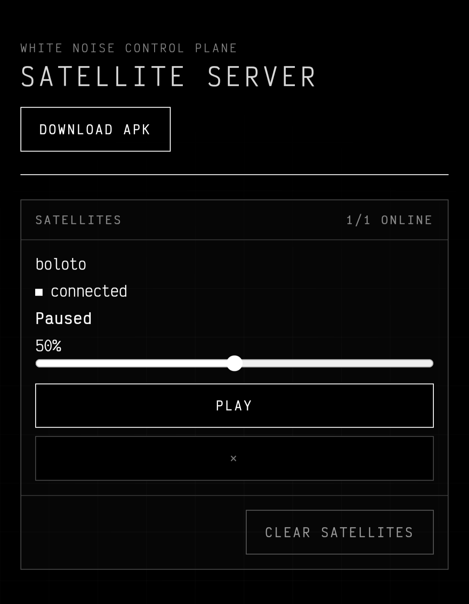
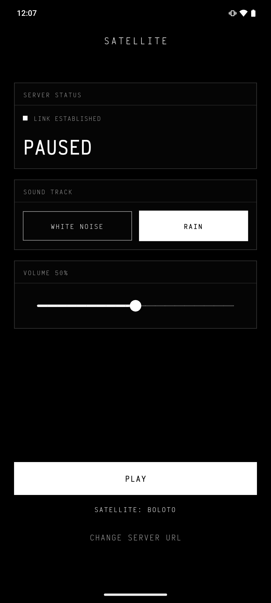

# Satellite

White-noise playback app made with Flutter and controlled by a Flask server.

## How To Run

1. Start the server in the background with `podman compose up` or `podman compose up -d`
2. Start the Flutter app with `cd app && flutter run` or download the app from the server web UI.

## Notes

- If testing on a physical Android device, set the app server URL to your machine LAN IP (for example `http://192.168.1.20:6333`).

## Screenshots

| Server | App |
|---|---|
|||
